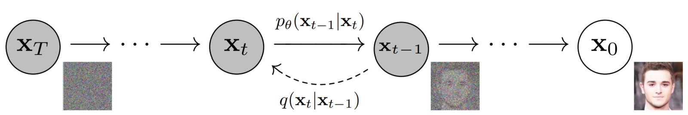
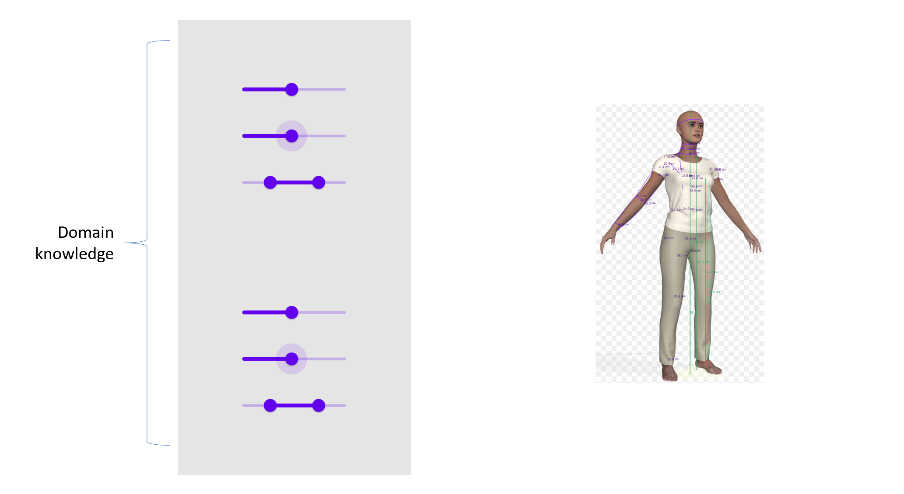
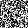
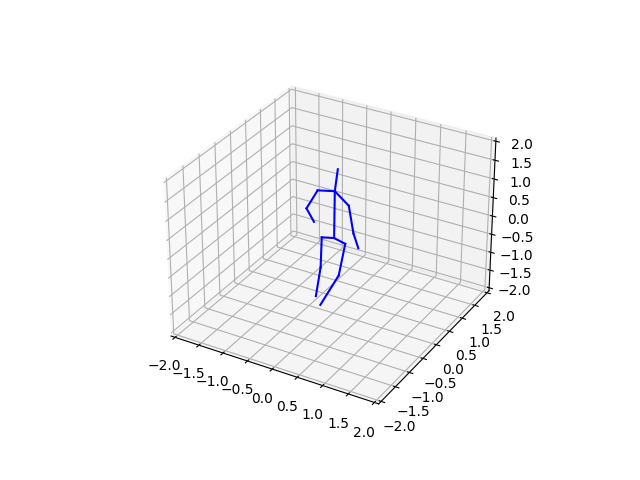
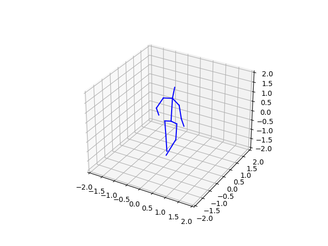

# DDPMs

<p align="center">
  
</p>

PD Gait Data Generation Using DDPMs and Weak Supervision: This code contains implementation of Denoising Diffusion Probabilistic Models with Classifer Free Guidance and DDIM sampler. The goal is to generate rare PD gait conditions using Weak Supervision. Using weak supervision is essential because labeling PD gait data is a very hard and time-consuming task and we want to be able to generate PD gait at different stages of the disease. Moreover, one can use this implementation on any sort of data such as fMRI.

<p align="center">
   
</p>

### Under Construction...
* **Warning: This project is still under development and it's not yet ready for real-world usage!** Please wait for the first official release... :)
* Soon the code would be available in the form of a library which could be installed using ```pip install``` command.
* more detail will be added after the first official release

Here are some results of the code on the MNIST dataset:

<p align="center">
  
</p>

This sample is generated without CFG and normal DDPM sampler (1000 steps):

<p align="center">
  
</p>

Here is a GIF of a generated digit from pure gaussian noise with the setting above:

<p align="center">
  </video>
</p>

This is the output of the model trained on real PD data for two Normal (Left) and Severe (Right) cases:

<div style="display: flex; justify-content: center; align-items: center;">
  <p align="center">
    
  </p>
  <p align="center">
    
  </p>
</div>
