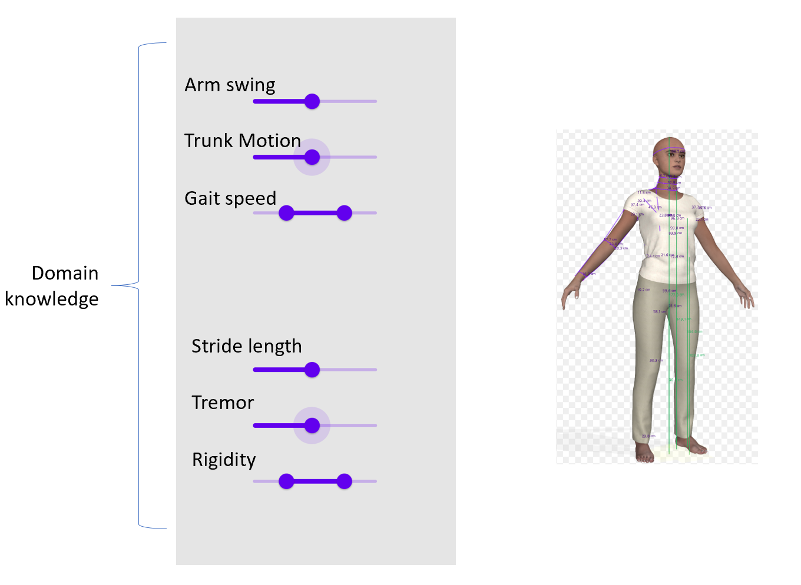

# DDPMs

<p align="center">
  
</p>

PD Gait Data Generation and High Accuracy Classification Using DDPMs: This repository includes code for implementing Denoising Diffusion Probabilistic Models enhanced with Classifier-Free Guidance and a DDIM sampler. It also introduces an innovative approach that integrates GANs with DDPMs, training a classifier in tandem with the Diffusion Model. This fusion utilizes gradients to augment the Diffusion Model's performance while achieving a highly accurate classifier. Additionally, this implementation is versatile and can be applied to various data types, including fMRI.

<p align="center">
   
</p>

### Under Construction...
* **Warning: This project is still under development and it's not yet ready for real-world usage!** Please wait for the first official release... :)
* Soon the code would be available in the form of a library which could be installed using ```pip install``` command.
* more detail will be added after the first official release

Here are some results of the code on the MNIST dataset:

<p align="center">
  
</p>

This sample is generated without CFG and normal DDPM sampler (1000 steps):

<p align="center">
  
</p>

Here is a GIF of a generated digit from pure gaussian noise with the setting above:

<p align="center">
  </video>
</p>

Overview of the moodel, I used a Transformer architecture to generate a timeseries data with the Weak Supervision model to guide the diffusion model:


<p align="center">
   
</p>

This is the output of the model trained on real PD data for two Normal (Left) and Severe (Right) cases:

<div style="display: flex; justify-content: center; align-items: center;">
  <p align="center">
    
    
  </p>
</div>
